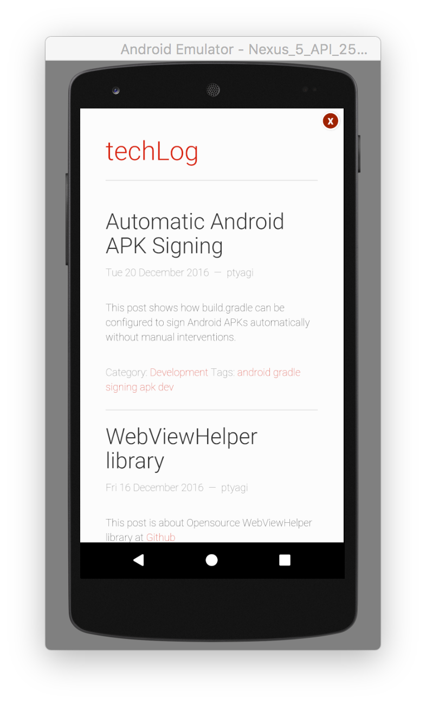
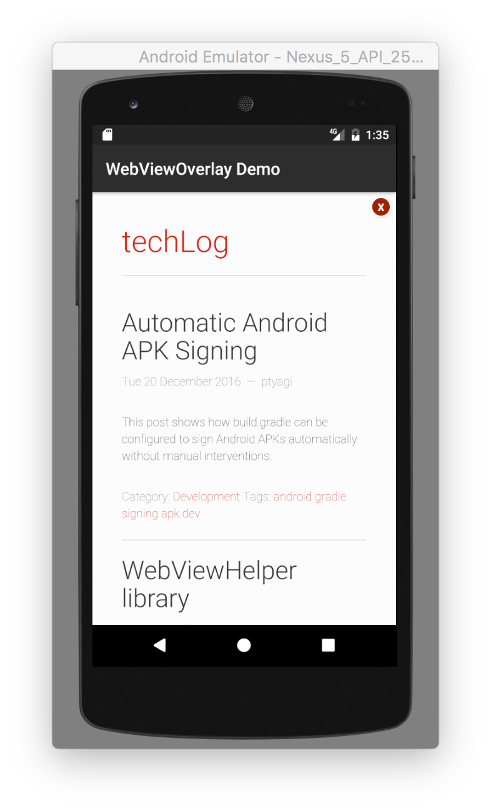

# Android WebViewOverlay Widget
A widget to load WebView in an Overlay.

## Motivation
I needed a widget that can load a url in WebView in a full-screen closable overlay/modal.
I wanted to re-use this new, shiny widget in my other projects as well. So, I decided to upload
WebViewOverlay library in a central artifact repository. I chose JCenter because its one of the
largest artifact repository for Java and Android libraries and has good integration with Android Studio IDE.

## WebViewOverlay Widget
WebViewOverlay widget loads a WebView widget in a full-screen pop-up. It has option to close it by
clicking on top-right corner 'x'

## API
There're two APIs to load WebView either in full-screen mode or in a dialog with a custom title.

***Full Screen Overlay***

```
void loadWebViewOverlay(String urlToBeLoaded, HashMap<String, String> params);
```


***Full Screen Overlay With Custom Title***

```
void loadWebViewOverlay(String urlToBeLoaded, HashMap<String, String> params, String popupTitle);
```


## Integration
In Android Studio, it can be added to your project by adding following in `build.gradle`
```
compile 'org.ptyagicodecamp:WebViewOverlay:1.0.2'
```

## Initialization
WebViewOverlay widget can be initialized in Activity or BaseActivity's `onCreate()` method.
```
WebViewOverlay webViewOverlay;

@Override
protected void onCreate(Bundle savedInstanceState) {
    super.onCreate(savedInstanceState);
    setContentView(R.layout.activity_main);

    webViewOverlay = new WebViewOverlay(this);
}
```

## Usage
After initializing widget, it can simply be used by calling either of the API.
Here's examples to demonstrate both APIs:
```
public void openWebViewOverlay(View view) {
    String url = "https://ptyagicodecamp.github.io";
    webViewOverlay.loadWebViewOverlay(url, null);
}

public void openWebViewOverlayWithTitle(View view) {
    String url = "https://ptyagicodecamp.github.io";
    webViewOverlay.loadWebViewOverlay(url, null, "WebViewOverlay Demo");
}
```
