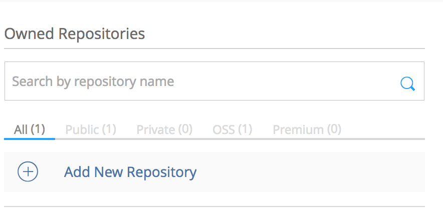
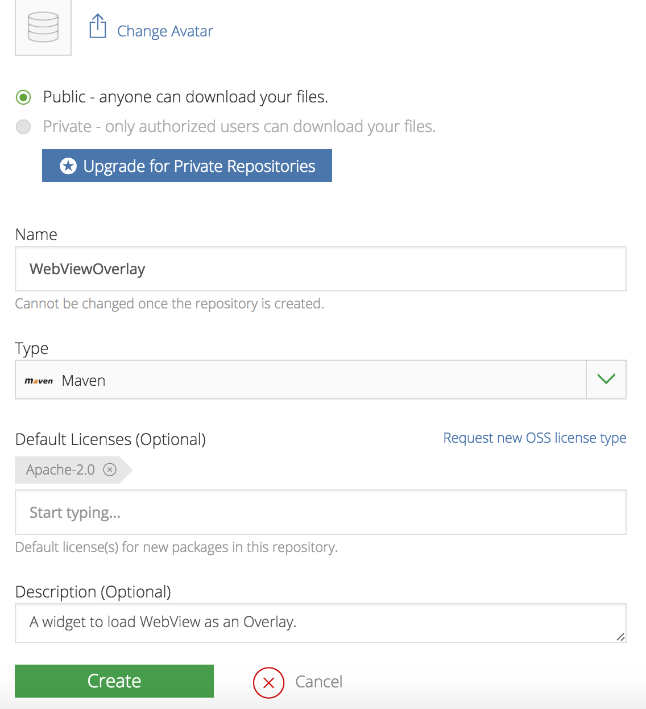
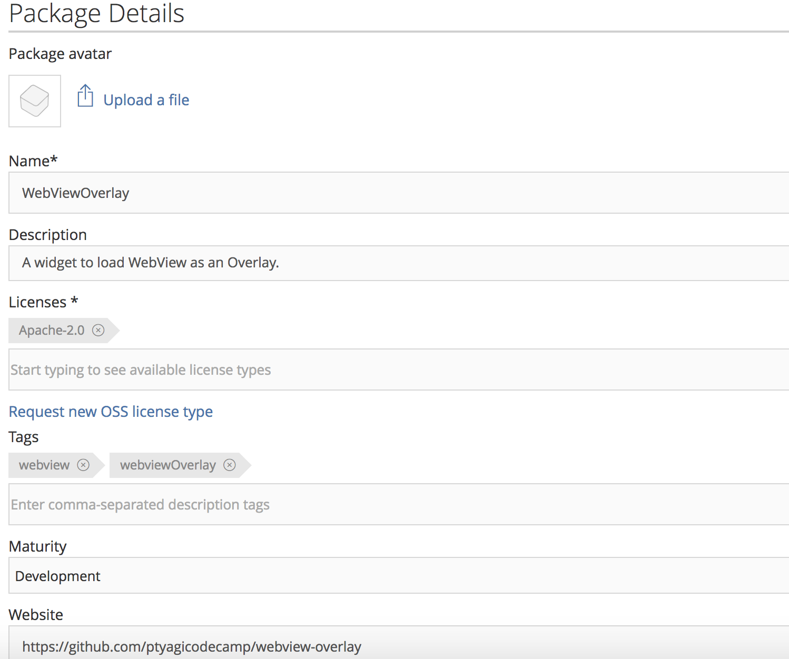

## How did I publish library to JCenter from Android Studio

JCenter is a Maven Repository or file server hosted by [Bintray](https://bintray.com/) for Android libraries. It’s a default repository for Android Studio.

##  Uploading Android library (in aar format) to Bintray
* Create log-in at https://bintray.com/. Scroll down to register for an open-source project.
* Create a new repo:
  

* Fill-in all required information and click "create repo". It'll redirect to "package" screen.
  

* Click on “Create Package”. Fill in your package name and click on "Add New Package":


* It'll take you to enter package details. Fill-in details and click on "Create Package" at the bottom.


And you’re Done with registering your Maven repository on Bintray !

***Note***: Link your Github account from Bintray, if you want to upload library from Android Studio/build.gradle.
You can do this by going into your repository on Bintray and selecting “Import from Github” option. It’ll guide you through with rest of the steps.

### Setting up Android Studio Project
* Create a new project in Android Studio.
* Module `WebViewOverlay` contains all the library code and module `app` has sample app to demonstrate the usage of library.
Make sure that you name module same as of artifact name configured at Bintray. `WebViewOverlay` in this example.
* Setup Android Studio project to be able to publish library to `jcenter()` Maven repo, and
add Bintray plugin to project’s `build.gradle`. Root level `build.gradle` will look like this:
```
buildscript {
    repositories {
        jcenter()
    }
    dependencies {
        classpath 'com.android.tools.build:gradle:2.2.3'
        classpath 'com.jfrog.bintray.gradle:gradle-bintray-plugin:1.4'
        classpath 'com.github.dcendents:android-maven-gradle-plugin:1.4.1'
    }
}

allprojects {
    repositories {
        jcenter()
    }
}
```

* Update Bintray related credentials in `local.properties` like this:
```
bintray.user=YOUR_BINTRAY_USERNAME
bintray.apikey=YOUR_BINTRAY_API_KEY
```
Note: Look for **API KEY** in your Profile section on Bintray.

* Add following in library module’s `build.gradle`. In this case `build.gradle` of `WebOverlay`:

```
apply plugin: 'com.android.library'

ext {
    bintrayRepo = 'WebViewOverlay'
    bintrayName = 'WebViewOverlay'

    publishedGroupId = 'org.ptyagicodecamp'
    libraryName = 'WebViewOverlay'
    artifact = 'WebViewOverlay'

    libraryDescription = 'A widget to load WebView as an Overlay.'

    siteUrl = 'https://github.com/ptyagicodecamp/webview-overlay'
    gitUrl = 'https://github.com/ptyagicodecamp/webview-overlay.git'

    libraryVersion = '1.0.0'

    developerId = 'ptyagicodecamp'
    developerName = 'Priyanka Tyagi'
    developerEmail = 'ptyagicodecamp@gmail.com'

    licenseName = 'The Apache Software License, Version 2.0'
    licenseUrl = 'http://www.apache.org/licenses/LICENSE-2.0.txt'
    allLicenses = ["Apache-2.0"]
}
```

* You would need to add these scripts in order to publish libraries to Bintray:
```
//Add these lines to publish library to bintray. This is the readymade scripts made by github user nuuneoi to make uploading to bintray easy.
//Place it at the end of the file
apply from: 'https://raw.githubusercontent.com/nuuneoi/JCenter/master/installv1.gradle'
apply from: 'https://raw.githubusercontent.com/nuuneoi/JCenter/master/bintrayv1.gradle'
```

That's all you ve to do in order to configure you Android Studio project.

### Uploading to Bintray:
CD to Root of Android Studio Project, and run these commands:
gradlew install
gradlew bintrayUpload

That’s it ! your artifact will be uploaded to Bintray.


### Refrences:
I followed this tutorial to get me setup at Bintray: https://inthecheesefactory.com/blog/how-to-upload-library-to-jcenter-maven-central-as-dependency/en


